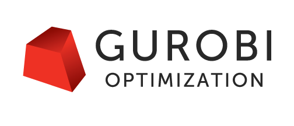

# Gurobi Machine Learning

Gurobi Machine Learning is a python package to insert trained predictors into a [gurobipy](https://pypi.org/project/gurobipy/) model.

The goal of the package is to:
  1. Simplify the process of importing a trained machine learning model built with a popular ML package into an optimization model.
  1. Improve algorithmic performance to enable the optimization model to explore a sizable space of solutions that satisfy the variable relationships captured in the ML model.
  1. Make it easier for optimization models to mix explicit and implicit constraints.

The package currently support the following regression models:
 - Scikit-learn:
    - Regression models:
      - Linear regression
      - Logistic regression
      - Neural-network regression (MLPRegressor)
      - Decision tree
      - Gradient boosting tree
      - Random Forest
    - Transformers:
      - Standard Scaler
      - Polynomial Features (degree 2)
 - Keras
   - Dense layers
   - ReLU layers
 - PyTorch (only torch.nn.Sequential objects)
   - Dense layers
   - ReLU layers
